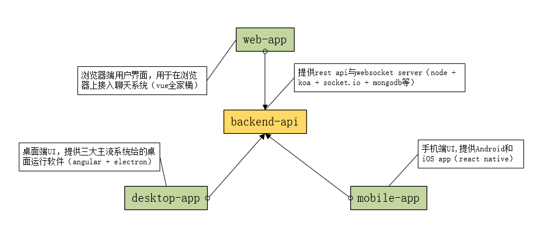

# FlyingChat(飞聊)

目标：全平台的即时聊天工具

# 项目结构

# 如何开发？

首先，需要先搭建好 `MongoDB` 数据库环境。之后，必须要先运行 [backend-api](backend-api) 项目，根据该项目的 `README` 操作即可。

之后，任意进入一个终端目录依据对应的 `README` 启动开发环境。

**前提：需要有一定的node基础，需要能基本使用npm。**
